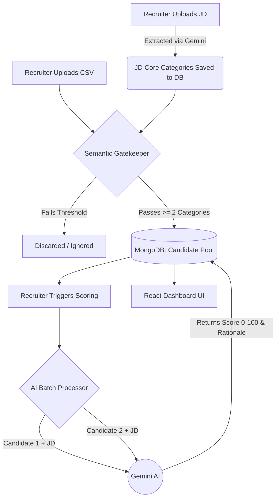

# 🤖 AI Recruiting Agent (Smart ATS)


An intelligent, multi-role Applicant Tracking System (ATS) that automates the most tedious parts of recruiting: discovering, pooling, semantically screening, and scoring candidates using Google's Gemini AI.

---

## 🚀 Live Demo

| Service | URL |
|---|---|
| **Frontend (Vercel)** | [https://ai-recruiter-ats.vercel.app](https://ai-recruiter-ats.vercel.app) |
| **Backend (Render)** | [https://ai-recruiter-backend-kbo7.onrender.com](https://ai-recruiter-backend-kbo7.onrender.com) |

---

## 🧠 Architecture & Scoring Logic

This platform uses a **Two-Phase filtering system** to prevent AI API rate limits (429 errors) and reduce token costs.

### Phase 1: The Zero-Token Semantic Gatekeeper

When a Job Description (JD) is saved, the AI extracts **"Core Categories"** (e.g., *Backend Languages, Cloud Platforms*). When candidates are uploaded via CSV, the Node.js backend **locally scans** resumes against these categories using synonym-matching — at zero token cost.

- **Threshold Safety Net:** Candidates must match a dynamic number of categories to pass. To prevent unfair rejection of short resumes, the requirement is capped at a maximum of `2` categories.
- Candidates who **fail** are silently discarded.
- Candidates who **pass** are saved to MongoDB as `"Pending Scoring"`.

### Phase 2: Token-Safe Deep AI Evaluation

Recruiters select pooled candidates and trigger deep Match Score generation. The backend uses a **batching queue** (with 2-second delays) to safely send the JD + Candidate Profile to Google Gemini, which returns a `0–100` match score and a text rationale.

### System Architecture



---


## 🛠️ Features

- **Multi-Role Coexistence** — Store Digital Marketers and Backend Devs in the same database without data overwriting (Unified Dashboard).
- **Smart Dropdowns** — UI dynamically builds filters based only on active candidates.
- **API Exhaustion Fallbacks** — Graceful UI handling (`⚠️ API Exhausted`) if email syncing or AI scoring hits rate limits.
- **Downloadable Action Reports** — Exports ranked CSVs with AI-recommended next steps (`🔥 Interview`, `🤔 Review`, `🛑 Reject`).

---

## 💻 Local Setup

This project is a **monorepo** containing both the Next.js frontend and Express/Node.js backend.

### Prerequisites

- Node.js (v18+)
- MongoDB URI
- Google Gemini API Key
- Gmail App Password (for outreach)

### 1. Clone the Repository

```bash
git clone https://github.com/YOUR-USERNAME/ai-recruiter.git
cd ai-recruiter
```

### 2. Setup the Backend

```bash
cd backend
npm install
```

Create a `.env` file in the `/backend` folder:

```env
PORT=5000
MONGO_URI=your_mongodb_connection_string
GEMINI_API_KEY=your_google_gemini_key
EMAIL_USER=your_gmail@gmail.com
EMAIL_APP_PASSWORD=your_16_letter_app_password
FRONTEND_URL=http://localhost:3000
```

Run the backend:

```bash
npm run dev
```

### 3. Setup the Frontend

Open a new terminal window:

```bash
cd ai-recruiter/frontend
npm install
```

Create a `.env.local` file in the `/frontend` folder:

```env
NEXT_PUBLIC_API_URL=http://localhost:5000
```

Run the frontend:

```bash
npm run dev
```

Visit **http://localhost:3000** in your browser!

---

## 📄 License

This project is licensed under the [MIT License](https://github.com/twbs/bootstrap/blob/main/LICENSE)
